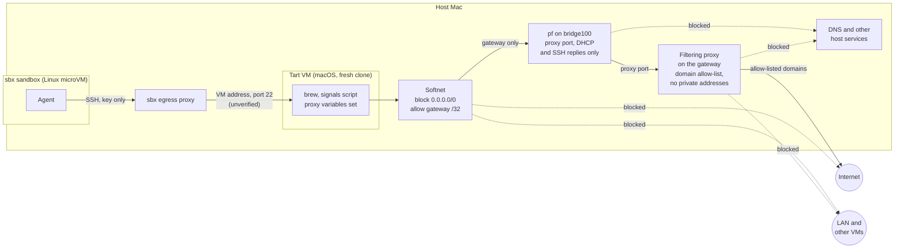

# macOS test VM for sandboxed agents

How to build the macOS VM that sandboxed agents use to check signal gathering. Why it's built this way, and the rules it follows (no API key, no route to `api.anthropic.com`), are in [ADR 15](adr/0015-macos-test-vm.md).

**Status: proposed, not built yet.** Flags and their behaviour come from the help output of `tart`, `softnet` and `sbx` (Tart 2.40.1 and Softnet 0.24.0 from the `openai/tools` tap) and from the tap's formulae. Other claims haven't been checked on this machine, and the points under [To verify](#to-verify) haven't been tested. tart.run's licensing page still shows the core-based tiers of the old Cirrus Labs Fair Source licence, which the `openai/tart` licence doesn't have.

## Overview

The agent stays in its `sbx` sandbox and runs commands in the VM over SSH. Each test session gets a fresh clone of a base image, so cask installs never pile up and anything that gets into the VM is thrown away. The VM's network goes through three layers, each covering a gap the others leave.



## Layer 1: Softnet, so the VM can only reach the host

Softnet is a userspace packet filter Tart runs alongside the VM. It filters by destination IPv4 CIDR only, with no domain or port rules. By default the VM can send to any globally routable address and to the host's gateway on the VM bridge, but not to private ranges (the LAN or other VMs).

Blocking everything and allowing only the gateway leaves the host as the VM's only destination:

```sh
tart run --no-graphics \
  --net-softnet-block=0.0.0.0/0 \
  --net-softnet-allow=192.168.64.1/32 \
  review-vm
```

When rules overlap, the longest prefix wins, and blocking wins an exact tie. `192.168.64.1` is the usual `bridge100` gateway. Incoming traffic isn't filtered, so SSH into the VM still works: the replies go to the gateway, which is allowed.

## Layer 2: a filtering proxy, for the domain allow-list

The VM sets `https_proxy` and `http_proxy`, plus the uppercase forms, to a proxy on the host listening on the gateway address. curl only reads the lowercase `http_proxy`, so both forms are needed. The proxy only allows listed domains and logs what it refuses, the same model as `sbx`'s policy log. For HTTPS, the proxy gets the hostname from the `CONNECT` request, so the VM never needs DNS.

Anything that ignores these variables can't reach the network at all, which fails safe but can break things:

- **Node's built-in `fetch`**, which the AI SDK uses, only follows them with `NODE_USE_ENV_PROXY=1` or `--use-env-proxy`. `brew` filters `NODE_USE_ENV_PROXY` out, so the formula's wrapper script sets it (see [ADR 3](adr/0003-distribute-as-source-built-formula.md)). The signals script makes no API calls, so this doesn't matter for testing in the VM.
- **macOS system services** use the system proxy settings (`networksetup`), not environment variables.

The proxy needs to:

- **refuse private, loopback and link-local destinations** after resolving each hostname, whatever the allow-list says. Softnet and `pf` don't apply to the proxy's own connections, so otherwise the VM could ask it for `127.0.0.1`, a LAN address or a `.local` name;
- **match whole hostnames**, so an entry for `github.com` doesn't also match `github.com.evil.example`;
- **only `CONNECT` to port 443.**

`tinyproxy` is small and supports default-deny hostname filtering, but it may not be able to check resolved addresses, and its filter patterns aren't anchored by default. Inspect it, and pick a proxy that meets all three needs.

The gateway address only exists while a VM is running, because `bridge100` comes and goes with it. Start the proxy after the VM boots, rather than binding it to every interface, which would expose it to the LAN.

Homebrew itself needs:

- `formulae.brew.sh`
- `ghcr.io` and `pkg-containers.githubusercontent.com` (bottles)
- `github.com`, `raw.githubusercontent.com` and GitHub's release asset host

Running the signals script from source also needs `registry.npmjs.org`, for `npm ci`.

**Never allow `api.anthropic.com`.** The VM gets no route to the API, so even if the agent runs `brew review` there, it can't make AI calls.

**Most casks download from the vendor's own site.** With a strict allow-list, each cask's download domain needs adding before it can be installed, from the cask's `url` or the proxy's deny log. The alternative is to allow every public domain through the proxy and only log it, still with an explicit deny for `api.anthropic.com`. That still keeps the VM off the LAN and the host's other services, but no longer limits where it can send data.

Even a strict allow-list narrows how data can leave rather than stopping it: `github.com`, `ghcr.io` and `registry.npmjs.org` all accept data from anyone with their own account. Keep all credentials out of the VM, including any Anthropic key, so nothing in it can act as you.

## Layer 3: `pf`, to close the gaps Softnet leaves

Because Softnet can't filter by port, allowing the gateway opens every port on it:

- **DNS:** the VM's resolver is the host's DNS proxy on the gateway. DNS can resolve any domain and can carry data out (DNS tunnelling).
- **Host services:** anything on the host listening on all interfaces is reachable from the VM.

`pf` rules on `bridge100` can narrow traffic to the gateway down to the proxy port and DHCP, which the VM needs to get its address. They also need to let through replies to the host's SSH connections into the VM, by keeping state on them. Block IPv6 on `bridge100` too, since Softnet's rules are IPv4 only. This needs `sudo`. macOS loads its own NAT rules for the bridge under `com.apple` anchors, which replacing the whole ruleset with `pfctl -f` can remove, so load these rules into a separate anchor. They don't survive a reboot.

Without this layer, a fair compromise is to check `sudo lsof -nP -iTCP -sTCP:LISTEN` and `sudo lsof -nP -iUDP` for anything listening on all interfaces, and accept the DNS risk. Without `sudo`, `lsof` only shows your own processes.

## The sandbox's access to the VM

- **Whatever the VM can reach, the sandbox can effectively reach too.** With SSH access, an agent manipulated by malicious content could use `ssh -L` or `-D` to send its own traffic through the VM: to the proxy's allow-list, including cask vendor domains the `sbx` policy doesn't allow, and to every host service on the gateway if `pf` isn't in place. `ssh -R` works the other way, giving the VM the sandbox's network. Setting `AllowTcpForwarding no`, `PermitTunnel no` and `AllowAgentForwarding no` in the base image's `sshd_config` makes this harder, but the VM user has `sudo` (cask installs need it), so the agent could turn them back on.
- Allow SSH to the VM for the one sandbox. A rule for the whole subnet would also reach the host's own SSH server at `192.168.64.1` and any other VM, so the VM script should add a rule for the clone's address when it boots and remove it afterwards:

  ```sh
  sbx policy allow network --sandbox claude-homebrew-review "<vm-ip>:22"
  ```

- The Cirrus Labs base images log in as `admin`/`admin`, which anything that can reach port 22, including the sandbox, could use. Switch the base image to key-only SSH and give the sandbox only that key. `tart run --provisioning-opts` can set the user, password and Remote Login instead, but only on the first boot of a newly created macOS 27 or newer guest on a macOS 27 or newer host. That means a base image built fresh from an IPSW, not a pulled Cirrus Labs image.
- The sandbox can't run `tart`, so SSH is its only way in.
- The code under test reaches the VM by `rsync` over SSH, or by mounting it read-only with `tart run --dir=<path>:ro` and copying it somewhere writable in the VM, since `npm ci` writes `node_modules` into the project.
- Output from commands in the VM, such as installer messages, comes back to the agent and should be treated as untrusted input.

- The signals script needs no terminal and no prompts, so plain `ssh` is enough.

## Setup

1. Trust Softnet, which comes from the same tap as Tart: `brew trust --formula openai/tools/softnet`. Naming `openai/tools/tart` on the command line trusts Tart itself, but not its dependencies. Softnet needs macOS Tahoe or newer on the host.
2. `brew install openai/tools/tart`. Tart moved from `cirruslabs/cli`, whose formulae no longer load.
3. Pull a base image with Homebrew installed and set it up for key-only SSH, with SSH forwarding turned off and the proxy variables set. Install `node@24` and put it on `PATH` (it's keg-only), since the signals script runs from source.
4. Write the proxy config and the `pf` anchor.
5. Add a committed script for each session that:
   - clones the base image and boots it with the Softnet flags;
   - waits for `tart ip`;
   - starts the proxy and loads the `pf` anchor;
   - adds the `sbx` rule for the VM's address and prints it;
   - when the session ends, removes the `sbx` rule, stops the proxy and deletes the clone.
6. Check each layer from inside the VM:
   - direct internet access is blocked;
   - the proxy allows only listed domains and refuses private addresses;
   - DNS lookups fail once `pf` is in place;
   - `brew install --cask` works through the proxy.

## To verify

- The gateway address on this Mac (`192.168.64.1` assumed).
- Whether SSH from the sandbox works at all: whether `sbx`'s egress proxy carries raw TCP rather than only HTTP(S), and whether it can reach the VM's address. If not, the sandbox needs another way in.
- Whether DHCP still works with `--net-softnet-block=0.0.0.0/0`.
- Whether the VM can reach the host over IPv6 on `bridge100`.
- Whether `pf` filters `bridge100` traffic from the Virtualization framework's NAT.
- What privileges Softnet needs on each run. It has options to drop privileges, which suggests it starts as root. It also changes the host DHCP server's lease time, a setting shared by every VM.
- The current base image registry path after Tart's move to `openai/tools`.
- Which casks can't install unattended in a VM:
  - those needing approval for kernel or system extensions;
  - those whose scripts download without using the proxy;
  - those relying on Apple's online Gatekeeper or notarisation checks.
